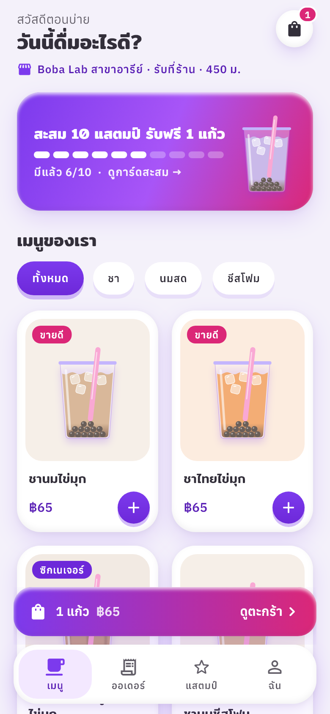
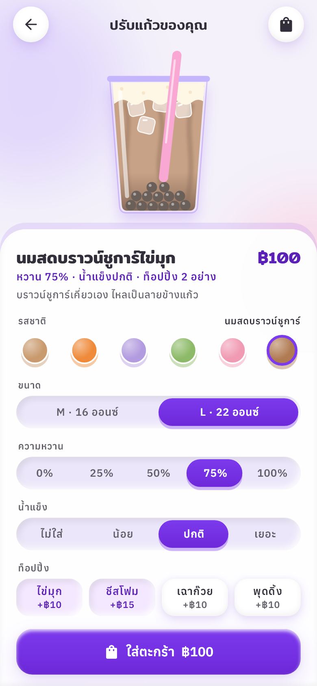
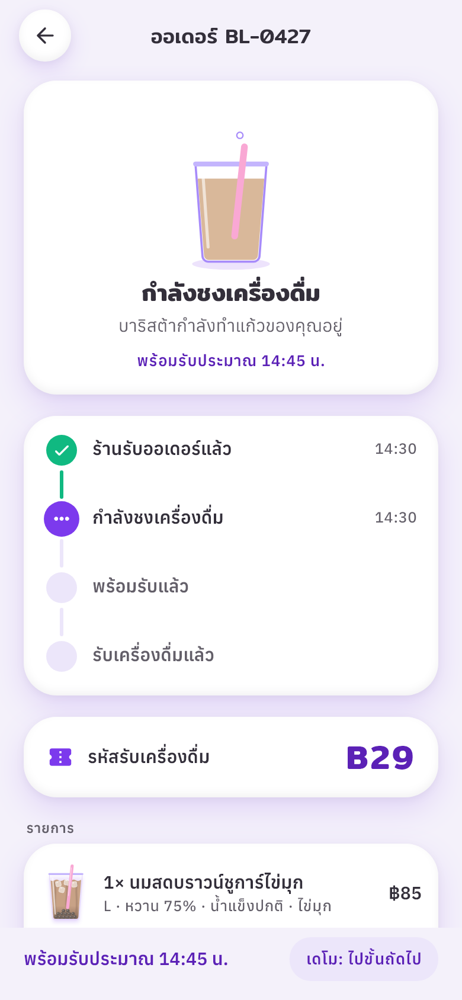
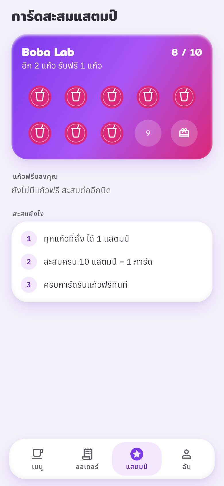

# Boba Lab

A bubble tea ordering app built with Flutter, as a frontend portfolio piece.
Every drink, price and order in it is sample data, and nothing is charged.

| Menu | Cup builder | Order tracking | Stamp card |
|---|---|---|---|
|  |  |  |  |

## What to try

- **Build a cup.** Pick a base, size, sweetness (0–100%), ice and toppings. Only the part you changed moves: pearls fall and squash on the floor, ice drops in one cube after another, cheese foam swells, the syrup level springs to the new sweetness, and brown sugar streaks down the wall.
- **Add it to the cart.** The cup arcs into the bag, the bag bounces, and the price counts up instead of jumping.
- **Check out.** Pay at the store, by card, or with a sample PromptPay QR (labelled as unpayable), then watch the order go from received to brewing to ready.
- **Collect stamps.** Each cup earns one; new stamps slam onto the card one after another. Ten make a free cup you can switch on in the cart.
- **Switch Thai and English** from onboarding, the profile tab, or the panel beside the phone frame on desktop.
- **Turn on Reduce motion** in the profile tab. Bounces, loops and confetti stop; every screen still works.

## How it was designed

**Problem.** Show frontend craft (motion, structure, attention to detail) in something a recruiter can open in a browser and understand in under a minute.

**Decisions**

- **Visual direction.** Three directions were mocked up side by side: Soft Clay (claymorphism), Pop Sticker (neo-brutalism) and Midnight Tea Bar (dark premium). Soft Clay won. Its palette and surface style come from the *ui-ux-pro-max* design database (Claymorphism, Mobile). The fonts it suggested have no Thai glyphs, so headings use **Mitr** and text uses **Anuphan**, both of which cover Thai and Latin.
- **Motion system.** Tokens follow the *motion-design* skill's Playful personality, all in [`lib/core/motion/motion.dart`](lib/core/motion/motion.dart):
  - One signature curve, `cubic-bezier(.34, 1.56, .64, 1)` (10–20% overshoot), carries most motion.
  - Three durations: 150, 250 and 400 ms.
  - Entrances bounce up from below, and exits are shorter and accelerate away.
  - Staggers stay under 500 ms.
  - A press squishes to 92%, then springs back.
- **The cup is a `CustomPainter`, not an image.** Each part has its own animation driven by state, and the same painter draws every menu thumbnail. One drawing covers all twelve drinks and any custom cup.
- **Lottie for illustration and feedback.** The 13 animations (splash logo, loading pearls, success check, confetti, stamp, order statuses, onboarding) are generated from code in [`tool/lottie/build_lottie.py`](tool/lottie/build_lottie.py). They use the same palette and the same curves as the Flutter motion tokens, so the two styles match.
- **Small on purpose.** There is no state-management package: four `ChangeNotifier`s sit behind an `InheritedWidget`. Routing uses `go_router`: tabs are a `StatefulShellRoute`, and every screen has a deep link on the web (for example `/#/build/brown-sugar-pearl`).
- **Made for a laptop visit.** On wide screens the app runs inside a phone frame, with a short pitch and a language switch beside it. Phones get the app full screen. Before Flutter loads, the page shows a branded loading screen.

**Structure**

```
lib/
  app/        app root, router, desktop phone frame
  core/       theme tokens, clay surfaces, motion (tokens, press, stagger, transitions), shared widgets
  data/       models and the sample menu
  state/      settings, cart, orders, stamps
  features/   splash, onboarding, shell, menu, builder, cup, cart, checkout, orders, rewards, profile
tool/lottie/  Lottie generator
test/         unit, widget, Lottie asset checks, screenshot and icon renderers
```

**Learnings**

- **Thai text needs fonts that actually cover Thai, and taller line heights.** Checking glyph coverage before building any screens saved redoing every one of them.
- **Overshoot curves and clamped `AnimationController`s don't mix.** The controllers stay linear, and the curves are applied when painting. That way pearls can squash and foam can overshoot without being clipped at 1.0.
- **Rendering every screen to an image in tests caught real bugs before any browser did.** Examples: a timeline that mixed `IntrinsicHeight` with `LayoutBuilder`, pills stretching inside a `Wrap`, and a chip label getting cut off in English.

## Run it

```bash
flutter pub get
flutter run -d chrome          # or any device
flutter test                   # unit and widget tests
```

Other commands:

```bash
flutter test --tags screenshots --run-skipped   # re-render docs/screenshots
flutter test --tags icons --run-skipped         # re-render web icons and favicon
python tool/lottie/build_lottie.py              # rebuild assets/lottie
```

## Deploy to GitHub Pages

1. Push this project to a GitHub repository.
2. In **Settings → Pages**, set **Source** to **GitHub Actions**.
3. Every push to `main` then runs [`.github/workflows/deploy-web.yml`](.github/workflows/deploy-web.yml), which analyzes, tests, builds and publishes the site at `https://<user>.github.io/<repo>/`.

For a `<user>.github.io` repository, change `--base-href` in the workflow to `/`.

## Credits

- Fonts: Mitr and Anuphan by Cadson Demak, SIL Open Font License 1.1 (license files in `assets/fonts`).
- Icons: Material Icons.
- Lottie animations, cup drawing and sample data are original to this project.
